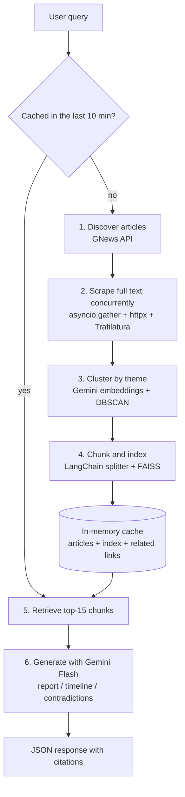

# AI News Intelligence

Turn 30 news articles into one grounded briefing. Enter a topic, and the app fetches recent coverage, scrapes the full text, groups duplicate stories by theme, and uses retrieval-augmented generation (RAG) to produce an **intelligence report**, a **timeline**, and an analysis of **where sources disagree**, with links back to every source used.

**Live demo:** https://ai-news-intelligence-xdtc.onrender.com
*(Free-tier hosting: the first request after a period of inactivity can take up to a minute while the server wakes up.)*

---

## Why

Following a news topic means reading the same story many times. A search for one topic returns dozens of articles, and many are the same wire report republished by different outlets. Getting the full picture means reading all of them, working out which ones add something new, piecing together the order of events, and noticing where sources contradict each other.

This project automates that work:

- **Groups duplicate coverage** so you see each distinct storyline once.
- **Answers only from fresh, fetched articles**, not from an LLM's training data.
- **Cites its sources**, so every output can be checked against the original articles.

## Features

| Feature | Description |
|---|---|
| **Intelligence report** | A multi-paragraph synthesis of the key developments, themes and patterns across all sources |
| **Timeline** | Key events extracted and ordered by date |
| **Contradictions** | Conflicting claims and opposing viewpoints between sources |
| **Related links** | One representative article per distinct theme, so duplicate wire copy doesn't crowd the list |
| **Source citations** | Every response lists the articles its answer was generated from |

---

## How it works



1. **Discover:** query the GNews API for up to 30 recent English-language articles (title, URL, source, publish date).
2. **Scrape:** fetch every article page concurrently with `asyncio.gather` on a shared `httpx.AsyncClient` (max 20 connections, 15 s timeout). Trafilatura extracts the article body without navigation, ads or comments, with a BeautifulSoup paragraph fallback. Pages that fail or yield too little text are dropped.
3. **Cluster:** embed each article with `gemini-embedding-001` and run DBSCAN (cosine distance, `eps=0.35`, `min_samples=2`). Each article gets a `theme_id`, and articles that match nothing else are labeled noise (`-1`). DBSCAN needs no preset number of clusters, which suits news where the number of storylines is unknown.
4. **Index:** split articles with `RecursiveCharacterTextSplitter` (1500 characters, 300 overlap, paragraph-aware) and attach source URL, title, publish date and theme ID to each chunk. Embed the chunks into an in-memory FAISS index.
5. **Retrieve:** embed the query and fetch the 15 nearest chunks.
6. **Generate:** place the retrieved chunks in one prompt (LangChain's "stuff" strategy) with one of three templates. Each template instructs the model to use only the provided context and to say so when the context is insufficient.

Steps 1–4 run **once per query** and are cached for 10 minutes. All three endpoints share the cached index, so switching from the report to the timeline or contradictions view only costs one LLM call.

---

## Tech stack

| Layer | Technology |
|---|---|
| Backend | Python 3.12, FastAPI, Uvicorn, Pydantic |
| News source | GNews API (NewsAPI also supported) |
| Scraping | httpx (async), asyncio, Trafilatura, BeautifulSoup |
| Embeddings | Google `gemini-embedding-001` |
| Clustering | scikit-learn DBSCAN, NumPy |
| RAG | LangChain (text splitter, retrieval and stuff-documents chains), FAISS (`faiss-cpu`) |
| LLM | Google Gemini Flash (`gemini-3.6-flash`), temperature 0.2 |
| Frontend | Jinja2 template, Tailwind CSS, vanilla JavaScript |
| Deployment | Render (free tier) |

---

## API

All endpoints accept a JSON body `{"query": "<topic>"}`. Interactive documentation is available at `/docs`.

### `POST /query`: intelligence report

```json
{
  "summary_html": "<p>The European Union's AI Act ...</p>",
  "cited_sources": [
    {"title": "EU passes landmark AI law", "url": "https://...", "published_at": "2026-09-30T14:22:00Z"}
  ],
  "related_links": [
    {"title": "EU passes landmark AI law", "url": "https://...", "source": "Reuters"}
  ],
  "total_articles_found": 24,
  "time_taken": "8.41s"
}
```

### `POST /api/timeline`: chronological events

Returns `query`, `timeline_html`, `cited_sources` and `time_taken`.

### `POST /api/contradictions`: conflicting claims across sources

Returns `query`, `analysis_html`, `cited_sources` and `time_taken`.

**Errors:** `400` for an empty query, `404` when no articles with usable text are found, `500` when fetching fails.

---

## Getting started

### Prerequisites

- Python 3.12
- A [Google AI Studio](https://aistudio.google.com/) API key (Gemini)
- A [GNews](https://gnews.io/) API key

### Setup

```bash
git clone https://github.com/KotraHaridutt/ai-news-intelligence.git
cd ai-news-intelligence

python -m venv venv
source venv/bin/activate        # Windows: venv\Scripts\activate
pip install -r requirements.txt
```

Create a `.env` file in the project root:

```env
GOOGLE_API_KEY=your_gemini_api_key
GNEWS_API_KEY=your_gnews_api_key
```

### Run

```bash
uvicorn server:app --reload
```

Open http://localhost:8000 for the UI, or http://localhost:8000/docs to try every endpoint.

---

## Deployment

The repository includes a `render.yaml` blueprint and a `Procfile`. On Render, create a web service from the repository, set `GOOGLE_API_KEY` and `GNEWS_API_KEY` as environment variables, and deploy. The start command is:

```bash
uvicorn server:app --host 0.0.0.0 --port $PORT
```

The free tier has 512 MB of RAM, so embeddings come from the Gemini API instead of a local Sentence-Transformers model. PyTorch alone would use most of the available memory.

---

## Project structure

```
ai-news-intelligence/
├── server.py                    # FastAPI app, endpoints, pipeline orchestration, cache
├── services/
│   ├── news_fetcher.py          # Article discovery (GNews) and concurrent scraping
│   ├── clustering_service.py    # Gemini embeddings + DBSCAN theme clustering
│   └── rag_service.py           # Chunking, FAISS index, prompts, retrieval chain
├── templates/index.html         # Web UI
├── static/style.css
├── render.yaml                  # Render deployment blueprint
├── Procfile
└── requirements.txt
```

---

## Design decisions

- **Query-time RAG instead of a persistent vector database.** Each query builds its own small index (about 150 chunks) from fresh articles, so the corpus is always current. An exact flat FAISS index is fast at this size, and an external vector database would add cost without benefit.
- **DBSCAN instead of K-Means.** The number of storylines per topic is unknown in advance, and DBSCAN can leave off-topic articles unassigned instead of forcing them into a cluster.
- **The "stuff" strategy instead of map-reduce.** Finding contradictions requires the model to see all sources at once. Map-reduce processes documents separately and would miss conflicts between them.
- **Paragraph-aware chunking.** News articles are plain prose, so splitting at paragraph boundaries keeps each claim together with its context without the extra cost of semantic chunking.

## Limitations and roadmap

- [ ] Add timeline and contradictions views to the UI (currently available through the API and `/docs`)
- [ ] Include source and date metadata in the LLM prompt so contradictions and timeline events are attributed to specific outlets
- [ ] Use theme IDs during retrieval (per-theme quotas or MMR) so duplicate coverage doesn't dominate the context
- [ ] Make embedding, indexing and LLM calls fully non-blocking (`ainvoke`, `asyncio.to_thread`)
- [ ] Replace the in-process cache with a bounded or shared cache (for example Redis) to support multiple instances
- [ ] Add inline per-claim citations and an automated faithfulness check

## License

[MIT](LICENSE)
